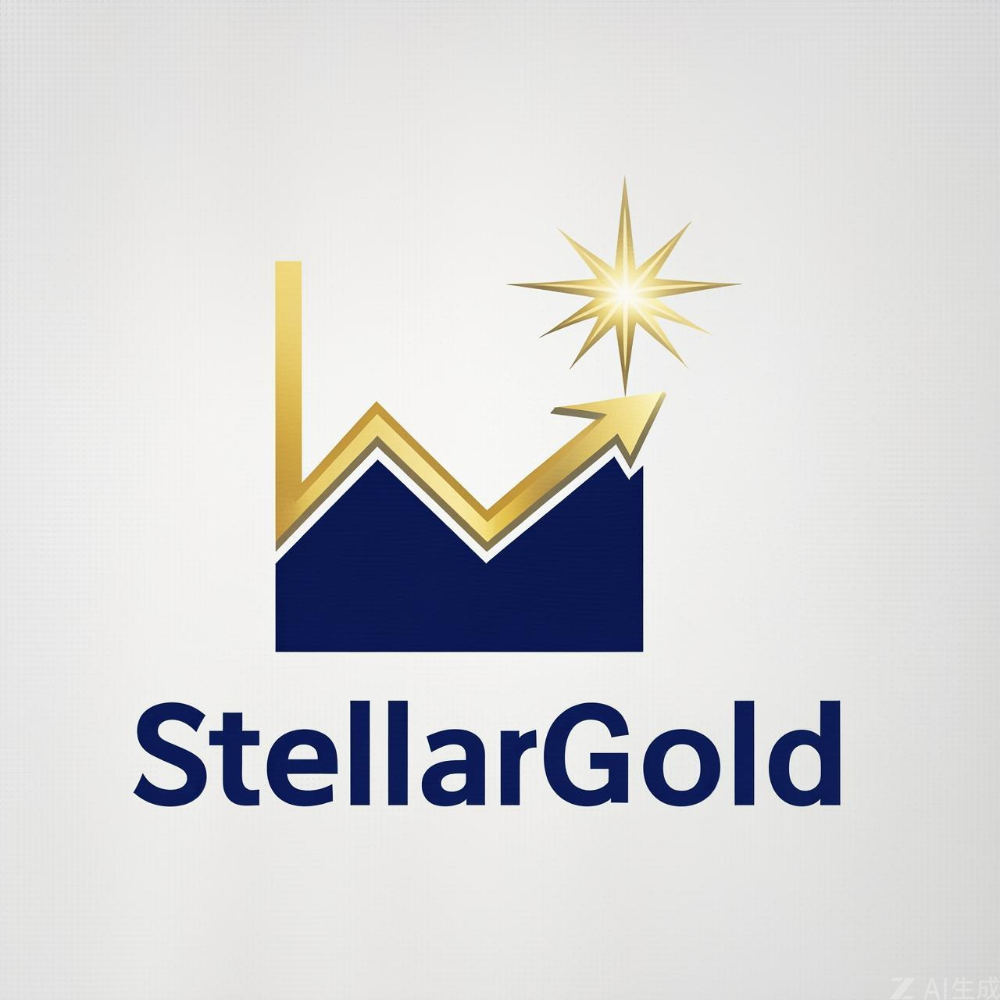

<div align="center">
  <h1>StellarGold</h1>
  
  <p><i>Gold Price Forecasting System</i></p>
</div>

---

## 📌 Tentang Proyek
Sistem prediksi harga emas untuk hari besok dan beberapa hari ke depan menggunakan algoritma SARIMA. Inflasi, nilai tukar, dan sentimen pasar sering mengubah harga emas. User kesulitan memprediksi pergerakan harga secara manual karena tidak terbiasa membaca data historis. Sistem ini menganalisis data historis untuk menemukan tren, perubahan harga, dan pola musiman, kemudian memberikan estimasi harga secara terstruktur agar user mendapat gambaran pergerakan harga emas sebelum mengambil keputusan investasi atau trading.

## 📊 Dataset
**Sumber**: [Yahoo Finance - Gold Futures (GC=F)](https://finance.yahoo.com/quote/GC=F/) | **Periode**: 2003 – 2026

| Kolom | Deskripsi |
|---|---|
| Date | Tanggal perdagangan |
| Open | Harga pembukaan (USD/Troy Oz) |
| High | Harga tertinggi (USD/Troy Oz) |
| Low | Harga terendah (USD/Troy Oz) |
| Close | Harga penutupan (USD/Troy Oz) |
| Volume | Volume perdagangan |

## 📈 Metode
Time Series Forecasting dengan perbandingan 3 model: ARIMA, SARIMA, dan Prophet. Data dianalisis melalui visualisasi, decomposition, ADF test, serta ACF dan PACF plot. Model dievaluasi menggunakan MAE, RMSE, MAPE, dan R².

| Model | MAE | RMSE | MAPE (%) | R² |
|---|---|---|---|---|
| **SARIMA** ✅ | **1061.62** | **1356.14** | **28.67** | **-1.26** |
| PROPHET | 1136.60 | 1419.41 | 31.10 | -1.48 |
| ARIMA | 1156.37 | 1463.60 | 31.37 | -1.64 |

> **Model Terbaik**: SARIMA(0,1,2)x(0,1,1,5)

## 🛠️ Tech Stack
**Python** · Pandas · NumPy · Statsmodels · Pmdarima · Prophet · Plotly · Streamlit · PostgreSQL · Apache Airflow · Docker · yfinance

## 🖥️ Output Proyek
- [**StellarGold Dashboard**](https://www.tableau.com/tableau-login-hub): Harga emas real-time + prediksi besok (USD & IDR/Gram)
- [**StellarGold APP**](https://huggingface.co/spaces/Darkaes/Stellar-Gold): Pilih tanggal spesifik untuk estimasi harga

## 📂 Struktur Proyek
```text
StellarGold/
├── Data Analysis/
|   └── (Dikelola oleh Data Analyst)
|   
├── Data Engineer/
|   ├── dags/
|   |    └── DAG.py
|   ├── scripts/
|   |    └── setup_connections.py
|   ├── app.py
|   ├── docker-compose.yaml
|   ├── requirements.txt
|   └── .env
|   
├── Data Science/
|   └── data_science_time_series.ipynb
|   └── data_science_time_series_inference.ipynb
|   └── sarima_final_model.7z
├── README.md
└── stellargold.png
```

## ⚠️ Challenges
- Volatilitas harga cukup tinggi karena dipengaruhi kondisi ekonomi global, inflasi, suku bunga, nilai tukar, dan sentimen pasar
- Forecast jangka panjang kurang stabil, error semakin membesar saat memprediksi banyak hari ke depan
- Periode test mengalami lonjakan harga besar sehingga model sulit mengikuti pergerakan aktual
- Model perlu refit secara berkala agar hasil inference tetap relevan dengan data terbaru

## ✅ Kesimpulan
- Berhasil membangun model prediksi harga emas berbasis time series menggunakan data historis 2003–2026
- SARIMA menjadi model terbaik dengan nilai error paling rendah dibandingkan ARIMA dan Prophet
- Model perlu dilatih ulang secara berkala karena pola harga emas dapat berubah signifikan dari waktu ke waktu

## 💼 Business Impact
- Mendukung pengambilan keputusan investasi/trading dengan gambaran estimasi harga emas ke depan
- Meningkatkan efisiensi analisis pasar karena user tidak perlu menganalisis data historis secara manual
- Membantu manajemen risiko sebagai referensi awal untuk antisipasi potensi kenaikan atau penurunan harga

## 🚀 Future Improvement
- **Integrasi Variabel Eksternal (SARIMAX)** : Menambahkan faktor makroekonomi seperti inflasi, suku bunga (Fed Rate), dan nilai tukar USD/IDR sebagai exogenous variable untuk meningkatkan akurasi prediksi
- **Penerapan Deep Learning** : Mengeksplorasi model LSTM atau Transformer yang mampu menangkap pola non-linear dan volatilitas tinggi secara lebih baik
- **Automated Retraining Pipeline** : Membangun mekanisme auto-refit pada Airflow agar model secara otomatis dilatih ulang dengan data terbaru tanpa intervensi manual
- **Sentiment Analysis** : Mengintegrasikan data berita ekonomi atau media sosial untuk menangkap sentimen pasar yang mempengaruhi pergerakan harga emas secara real-time
- **Sistem Alert & Notifikasi** : Menambahkan fitur peringatan otomatis (email/Telegram) ketika prediksi harga mendekati titik beli atau jual yang ditentukan user
- **Multi-Asset Forecasting** : Memperluas sistem untuk memprediksi aset komoditas lainnya seperti perak, minyak, atau indeks saham

## 🤝 Tim
**FTDS-HCK-038 | Group 002**

| Nama | Peran |
|---|---|
| Adib Nugroho | Data Analyst |
| David Andrian | Data Engineer |
| Michael Richard L | Data Scientist |

---

<p align="center">
  <strong>StellarGold</strong> · FTDS-HCK-038 · Hacktiv8 · 2026
</p>
```
